# Abstract

Most football match prediction systems rely only on team-level statistics such
as historical results and rankings, ignoring the fact that national squads are
almost entirely rebuilt between World Cup cycles. Team reputation is therefore
a weak and slow-moving signal for a tournament whose rosters change every four
years. This project builds a **player-aware** match outcome predictor that
fuses individual player attributes — technical, physical, mental, and
goalkeeping ratings — aggregated into year-specific team profiles, with
team-level match history computed *as of each match date* (Elo, weighted win
ratio, head-to-head record, recent form). The resulting features are
standardized and reduced via Principal Component Analysis (PCA), then fed into
a five-model ensemble (Logistic Regression, Random Forest, XGBoost, AdaBoost,
KNN) combined through hard majority voting, and benchmarked against a Weighted
Win Ratio (WWR) baseline derived from historical results alone.

The dataset comprises **1,749 team-year squad profiles** (189 nations, FIFA
editions 2015–2025) joined onto **1,504 usable World Cup matches** (finals and
qualifiers, draws excluded), described by **64 engineered features** reduced to
**22–23 principal components**. To avoid reporting a figure that model
selection had already been run against, the **2025 season was withheld
entirely** from development and scored exactly once. On that holdout the
ensemble reaches **82.2% accuracy against the baseline's 75.4%** — a **+6.8
percentage-point margin that is statistically significant** (McNemar's test,
$p = 0.0134$), with ROC-AUC 0.907. On development data (2015–2024, five random
seeds) the ensemble scores **79.0% ± 3.3%** against **76.0% ± 3.1%**, ahead on
all five seeds. For reference, the paper this work reproduces reports 59.38%
against a 56.25% baseline. The full pipeline is exposed through a live web
application (FastAPI backend + React frontend) giving per-match predictions
with model agreement, alongside an interactive evaluation dashboard.

# Introduction

Predicting the outcome of a football match is a well-studied but persistently
hard problem: results are influenced by dozens of interacting factors, from
squad quality to tournament pressure to raw luck. Two prediction paradigms
dominate the literature:

1. **Team-level models** — use historical results, rankings (e.g. FIFA or Elo
   ratings), and head-to-head records as features. These are simple and
   reasonably strong for club football, where squads persist season to season.
2. **Player-level / player-aware models** — incorporate individual player
   attributes, aggregated to the team level, on top of team-level history.

For the FIFA World Cup specifically, team-level models face a structural
weakness: national squads are drawn from players across dozens of different
club leagues and are effectively rebuilt for every tournament cycle. A team's
historical win ratio reflects a *different* group of players than the one that
will take the field next tournament. This motivates a player-aware approach,
where the technical and physical attributes of the current squad are a primary
signal and historical team form is a complementary one.

This project follows the methodology of Al-Bustami & Ghazal (2025), who propose
exactly this combination — player attributes aggregated into year-specific team
profiles, dimensionality-reduced via PCA, and classified with a five-model
majority-voting ensemble — benchmarked against a Weighted Win Ratio baseline.
We reproduce that pipeline end-to-end on real, public data, evaluate it under
the same metrics, and extend it in three directions the original does not
cover:

- **Information parity between the two models.** In the paper's framing the
  ensemble sees squad attributes and the baseline sees results. Measured here,
  that makes them near-equal scorers that disagree on roughly a third of
  matches — neither dominates because neither is given what the other knows.
  Section 4.6 adds as-of-date history features so the ensemble sees both.
- **A protected evaluation set.** Roughly fifteen configurations were compared
  over the course of this work against the same five random splits. That is
  model selection on a test set. Section 4.11 withholds a full season so the
  headline number has never been optimised against.
- **A genuine forward test.** Section 5.11 scores the model against the 2026
  World Cup knockout bracket, which no part of the pipeline has seen.

**Objective.** Build a generalizable, player-aware ML model for World Cup match
prediction and benchmark it against a historical win-ratio baseline.

**Scope.** FIFA World Cup matches (finals and qualifiers) using player rosters
from FIFA game editions 15 through EA FC 25 (calendar years 2015–2025), framed
as binary win/loss classification with draws excluded, consistent with the
reference paper.

# Literature Survey

Football outcome prediction has been approached with a wide range of methods,
which broadly fall into three families:

- **Statistical / ranking-based models** (e.g. Elo, Poisson goal models)
  estimate team strength from historical score lines. They are simple and
  well-calibrated for frequently-played matchups, but weak whenever squad
  composition changes faster than the rating can adapt — exactly the World Cup
  case. Elo in particular remains a strong benchmark and, as Section 4.6 shows,
  a strong *feature*.
- **Team-level machine learning models** replace the hand-built rating formula
  with a learned classifier over team-level features (rankings, recent form,
  home advantage). These improve on pure statistical models but still treat the
  team as a single opaque unit.
- **Player-aware machine learning models** aggregate individual player
  attributes (technical, physical, mental, goalkeeping) into a team
  representation, allowing the model to react to roster changes between
  tournaments. This is the family this project belongs to, and the one followed
  most directly by Al-Bustami & Ghazal (2025), whose feature-selection
  principles (relevance, completeness, non-redundancy), Weighted Win Ratio
  baseline, and five-model majority-voting ensemble this project reproduces.

The key gap the player-aware family addresses is **squad turnover**: a national
team's roster is rebuilt from players across different clubs every cycle, so a
team-level historical record answers "how has this team name performed" rather
than "how good are the players who will actually play." Player-level
aggregation closes that gap at the cost of needing per-edition player attribute
data, which this project sources from the same family of public datasets used
in prior player-aware work.

# Methodology

## Data Sources

Three public datasets were used — two player sources and one match source:

| Level | Dataset | Source |
|---|---|---|
| Player | FIFA Complete Player Dataset, one file per game edition | Kaggle: `stefanoleone992/fifa-{edition}-complete-player-dataset` (FIFA 15–23, EA FC 24) |
| Player | EA Sports FC 25 database | Kaggle: `nyagami/ea-sports-fc-25-database-ratings-and-stats` |
| Match | International football results, 1872–present | Kaggle: `martj42/international-football-results-from-1872-to-2017` (slug frozen, dataset actively updated) |

The player dataset is versioned per game edition, mapped to a roster year via
`edition = year - 2000`, covering 2015–2025. EA renamed the series after FIFA
23 and the original author stopped publishing after EA FC 24, so the 2025
edition comes from a different author with its own schema and is normalized
onto the canonical column set by `src/data/adapters.py`. Four attributes
(`value_eur`, `wage_eur`, `international_reputation`, `potential`) are simply
absent from that source and are therefore excluded from *every* year, rather
than being imputed for 2025.

The match dataset provides **49,518 played international matches**, of which
**9,839** are World Cup finals or qualifiers. Of those, **2,730** fall in the
2015–2025 player-data window; **581 (21.3%)** are draws and excluded by the
binary framing, and **1,504** of the remaining 2,149 survive the join to squad
profiles for both sides. The full international record — not just the World Cup
subset — is used to compute the match-history features of Section 4.6, since
Elo and form need volume to mean anything.

## Squad Selection

Each player record carries a `nation_position` field, populated only for
players EA has licensed as part of that edition's official national squad.
Because EA licenses only a subset of federations per edition (50 nations in
FIFA 18 versus 33 in FIFA 22), using `nation_position` alone would silently
drop the unlicensed federations' matches — 13 of 40 teams from the 2018 and
2022 World Cups, leaving 35 of 128 matches usable instead of 118.

Squad selection therefore has two paths: the licensed call-up list where a
(nationality, year) pair has one, and a **proxy squad** picked by rating where
it does not. The proxy path fills a positional quota — 3 goalkeepers, 8
defenders, 8 midfielders, 4 forwards, backfilled from the best remaining
players — rather than taking the top 23 by `overall` outright.

That distinction is not cosmetic. EA rates goalkeepers systematically below
outfielders, so a nation's best keeper often falls outside its top 23 entirely
(Algeria 2017's ranks 32nd among his compatriots). Taking the top 23 outright
left **58% of proxy squads with no goalkeeper at all**, which skews every squad
mean toward attacking attributes and makes any position-restricted aggregate
meaningless. The quota fixes both.

A consequence worth stating plainly: the FC 25 source carries no national-team
tags at all, so every 2025 squad is a proxy. This is a difference of degree
rather than kind — the fallback was already load-bearing for unlicensed
federations in earlier years — but it means the holdout season is built
entirely from proxy squads.

## Data Cleaning

Following the reference paper's three feature-selection principles:

1. **Relevance** — only attributes describing offensive, defensive, physical,
   mental, or goalkeeping proficiency are retained.
2. **Completeness** — columns missing for more than 20% of rows are dropped,
   applied *after* squad filtering, since `nation_position` is itself null for
   ~94% of the unfiltered player pool by design.
3. **Non-redundancy** — highly correlated attributes (pairwise correlation
   > 0.9) can be dropped to avoid multicollinearity.

## Team-Year Profiles

Individual player rows are aggregated into a single **team-year profile** per
(nation, year) pair, producing **1,749 profiles across 189 nations** — one row
per national team per edition, so the same team carries a different feature
vector in different cycles. Median squad size is 16 rated players.

Aggregation is deliberately of three kinds, because a flat squad mean answers
the wrong question in two places:

- **Squad means** over every numeric attribute — the paper's original
  aggregation, and a fair summary of squad *depth*.
- **Shape of the overall rating** (`overall_max`, `overall_top3`,
  `overall_spread`). The mean measures depth, which wins leagues; a single
  knockout match is often decided by the two or three best players on the
  pitch. Norway 2025 is the worked example: squad mean 76.6 against Brazil's
  84.4, but a higher best player (91 to 90) and a top-3 within 1.7 points. By
  the mean it is a mismatch; by the shape it is the close game it turned out
  to be.
- **Position-restricted summaries** (`overall_gk/def/mid/att`,
  `goalkeeping_core`, `defending_core`, `attacking_core`). Averaging
  `goalkeeping_*` across 23 players, ~20 of whom are outfielders with junk
  keeper ratings, measures almost nothing. These are added *alongside* the
  squad-wide means rather than replacing them, because a nation whose rated
  pool contains no keeper yields NaN here — true of 27% of match rows.

## Feature Engineering

Each match is between a home team ("Team A") and an away team ("Team B"). For
every profile attribute the feature row carries the difference
`attr_diff = attr_a - attr_b`.

**Only the difference is kept.** The `_a`, `_b`, `_diff` triple the paper
implies is collinear by construction — `diff` is exactly `a - b` — and costs
three times the dimensionality for no extra information about which side is
stronger. Measured across five seeds, dropping to differences alone (188
features → 64) held accuracy while cutting seed-to-seed spread from 1.9 to 1.1
points.

Two features describe the *fixture* rather than either team and so carry no
suffix:

- **`neutral_site`.** World Cup qualifiers are played home-and-away and the
  home side wins **63.6%** of them; on neutral ground it is **46.8%**, near a
  coin flip. Without this flag the model blends the two and applies a phantom
  home advantage to every neutral-venue fixture — which is every match at the
  tournament itself.
- **`squad_size_min`.** Profiles are assembled from whoever EA rated, so a
  "team" can be two players: 47.5% of match rows have at least one side built
  from fewer than 11 rated players, and 32.6% from fewer than five. The minimum
  is the right summary, since a comparison is only as reliable as its weaker
  half.

**Squads are joined by match date, not calendar year.** The edition labelled
year *Y* ships in about September of *Y−1*, and **67.6%** of the matches in
scope are played September to December. Joining on the calendar year hands
those fixtures ratings a median of twelve months old while a fresher edition
already exists. Joining on the edition current at the match date moves 55% of
rows onto newer squads, and was worth **+1.5 points** — the single largest gain
of any change in this project (Section 5.13).

This produces **64 features** per match. Draws are excluded, giving 1,504
usable matches.

## Match-History Features

The player-attribute features describe squads and say nothing about results;
the WWR baseline is the mirror image. Measured directly, the two scored within
a point of each other while disagreeing on roughly a third of matches, and on
the matches the baseline got wrong the ensemble was right 44% of the time — a
perfect router between them would have scored 85.9%. The ensemble had simply
never been given what the baseline knows.

`src/features/history_features.py` closes that gap with six per-team families,
each emitted as a difference:

| Feature | Meaning |
|---|---|
| `elo_diff` | Classic Elo, updated chronologically over the whole record |
| `wwr_diff` | The baseline's own credibility-weighted win ratio |
| `played_diff` | Matches played to date (the $v$ term WWR shrinks on) |
| `h2h_winrate_diff` | Head-to-head record against this specific opponent, shrunk toward 0.5 |
| `form_win_diff` | Win rate over the last 10 matches |
| `form_gd_diff` | Mean goal difference over that same window |

**Every value is computed as of the match date**, from matches strictly earlier
than it. Leak-freedom is therefore structural rather than a property of the
split: the frame stays honest under any split strategy, including the random
split used here, where a train-split-only fit would still let a 2022 result
inform a 2018 prediction. Same-day fixtures are excluded too — every match on
date *D* is snapshotted before any of *D*'s results are applied, so two matches
on the same day cannot see each other regardless of file order. The property is
invisible in the output (a leaky version produces a perfectly plausible frame),
so it is asserted directly in `tests/test_history_features.py`.

**Elo weighting** was implemented following the World Football Elo convention
and then split in two when measured separately — and only half of it survived.
See Section 5.13.

## Training-Row Mirroring

World Cup finals are played on neutral ground, but the source data still lists
one team as "home", and 61% of rows are home wins. Without intervention the
model learns argument order as if it were signal. Mirroring appends a
side-swapped copy of a training row with the label flipped.

Two constraints make it work rather than hurt:

- **Neutral rows only.** Mirroring *everything* cost about two points of
  accuracy, because asserting that the away side of a qualifier had home
  advantage is simply false. Restricted to rows where the side ordering really
  is arbitrary, it adds 0.4 points and cuts seed-to-seed spread from 3.0 to 2.0.
- **Strictly after the train/test split.** Mirroring first would put a row and
  its own copy on opposite sides of the split — the same match in both train
  and test.

## Baseline Model: Weighted Win Ratio (WWR)

The baseline uses only team-level historical results, per the reference paper's
Section IV:

- If two teams have played at least 5 matches head-to-head (the paper's
  75th-percentile threshold), the team with more head-to-head wins is predicted
  to win.
- Otherwise, each team's **Weighted Win Ratio** is a credibility-weighted
  shrinkage estimate:

$$
\text{WWR} = \frac{v}{v+m}\,R \;+\; \frac{m}{v+m}\,C
$$

where $v$ is the number of matches the team has played, $R$ its win ratio, $C$
the global win ratio across all teams, and $m$ a shrinkage parameter (set to
10). This is the same family of estimator used for IMDB's weighted ratings:
teams with few recorded matches are pulled toward the global average, teams
with a long track record are trusted closer to their own ratio.

The baseline is fit on the **full 9,839-match World Cup history** — all years,
not merely the 2015–2025 window with player data — excluding only the exact
rows held out for testing in a given run, matched on `(date, home_team,
away_team)`. It is therefore a strong benchmark rather than a straw man, and
Section 5.12 tests directly whether it is handicapped relative to the ensemble.

## Ensemble Model

Five classifiers are trained and combined via **hard majority voting**:

| Model | Role |
|---|---|
| Logistic Regression | Linear, interpretable baseline-within-the-ensemble |
| Random Forest | Tree-based, robust on tabular features |
| XGBoost | Gradient-boosted trees, strong on tabular data |
| AdaBoost | Boosted weak learners, a different bias/variance trade-off |
| K-Nearest Neighbors | Non-parametric, adds a different decision boundary |

Each model's hyperparameters are selected by 5-fold cross-validation on the
training split (grid search per model type) before being wrapped in a
`VotingClassifier`. Both the CV fold shuffle and each estimator's own
`random_state` are seeded from the current run's seed — holding model
randomness fixed across "different" seeds would make the reported spread
reflect split variance alone.

## Evaluation Protocol

Each run performs a stratified 80/20 train/test split and reports overall
accuracy, accuracy split by high- versus low-scoring matches (combined goals
$\geq 3$), and accuracy on "challenging cases" — the subset of test matches the
baseline got wrong, isolating whether player-level features add value precisely
where team-level history fails.

Four operations are fit on the training split only, never the full frame:
missing-value imputation, the scaler, PCA, and the hyperparameter search. Row
mirroring likewise happens after the split. Every reported development number
is averaged across **five random seeds** (0, 1, 17, 42, 123) with the standard
deviation alongside.

## Why There Is a Holdout

Roughly fifteen configurations were compared against those same five random
splits over the course of this work, each kept or discarded on how it scored
there. That is model selection on a test set, and its effect compounds quietly.
It showed up directly: across the same stretch the random-split figure climbed
78.9% → 80.3% while an untuned temporal split moved 79.7% → 79.5%. The last
round of apparent gains had not replicated.

**The 2025 season is therefore withheld entirely.** `build_match_dataset()`
drops it before returning, so it reaches neither feature selection,
hyperparameter tuning, the seed-variance charts, the figures, nor the served
model. The only reader is `python -m src.holdout`, which trains on all 1,223
development matches and scores the 281 withheld ones exactly once.

The cost is real — 281 fewer training matches — and the benefit is a number no
decision was made against. One caveat is kept explicit in Section 6: the
holdout was locked *after* most configuration choices had already been made
with 2025 visible, so it is clean from the FC 25 adapter onward, not for the
whole history of the project.

# Results and Evaluation

Results are reported at two levels, and the distinction matters: **development
numbers choose the model, the holdout number reports it.** They are not
comparable row-to-row, and are never quoted interchangeably below.

## Headline: the Withheld 2025 Season

Trained on all 1,223 development matches (2015–2024) and scored once on the 281
withheld matches of 2025:

| Model | Accuracy |
|---|---|
| **Proposed ensemble** | **82.2%** |
| Weighted Win Ratio baseline | 75.4% |
| Always predict the home side | 59.4% |

The **+6.8 percentage-point margin is statistically significant** — McNemar's
test on the paired predictions gives $p = 0.0134$ ($b = 36$ matches the
ensemble won and the baseline lost, against $c = 17$ the other way) — which is
the first time that has been true in this project.

The supporting metrics on the same 281 matches:

| | Ensemble | Baseline |
|---|---|---|
| Overall accuracy | **82.2%** | 75.4% |
| High-scoring / low-scoring | 86.1% / 77.2% | 78.5% / 71.5% |
| Precision / recall / F1 | 0.842 / 0.862 / 0.852 | 0.827 / 0.743 / 0.782 |
| ROC-AUC | 0.907 | — |
| Challenging cases recovered | 36 of 69 (**52.2%**) | — |
| Unanimous vote (5/5) | 85.1% on 242 matches | — |
| Split vote (4/5 or 3/5) | 64.1% on 39 matches | — |

Individual base models score 79.4% to 82.6% before the vote, so the ensemble
sits at the top of its own members' range rather than beyond it.

Two qualifications belong next to that number rather than in a footnote. First,
all 281 holdout matches are World Cup **qualifiers**; no finals were played in
2025, so the headline is measured on qualifying fixtures only. Second, the
holdout was locked partway through the project, as Section 4.11 describes. That
it came in *above* the development estimate rather than below is the reassuring
direction, but it is a single measurement of a single season.

## Development Results Across Five Seeds

Every remaining number in this section comes from development data (2015–2024,
1,223 matches, 245 per test split), averaged over five random seeds:

| Model | Overall Accuracy |
|---|---|
| **Proposed ensemble** | **79.0% ± 3.3%** |
| Weighted Win Ratio baseline | 76.0% ± 3.1% |

Per seed:

| Seed | Ensemble | Baseline | Margin |
|---|---|---|---|
| 0 | 83.7% | 80.0% | +3.7 pp |
| 1 | 76.3% | 72.7% | +3.7 pp |
| 17 | 81.2% | 78.0% | +3.3 pp |
| 42 | 76.3% | 73.5% | +2.9 pp |
| 123 | 77.6% | 75.9% | +1.6 pp |
| **Mean** | **79.0%** | **76.0%** | **+3.0 pp** |

The ensemble is ahead on **all five seeds**. That consistency is the meaningful
claim at this sample size; the ±3.3% spread means the *level* on any single
split should not be over-read.

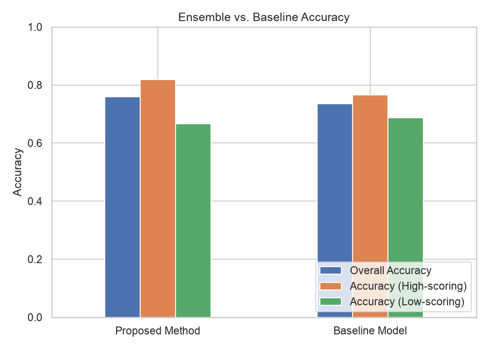{width=80%}

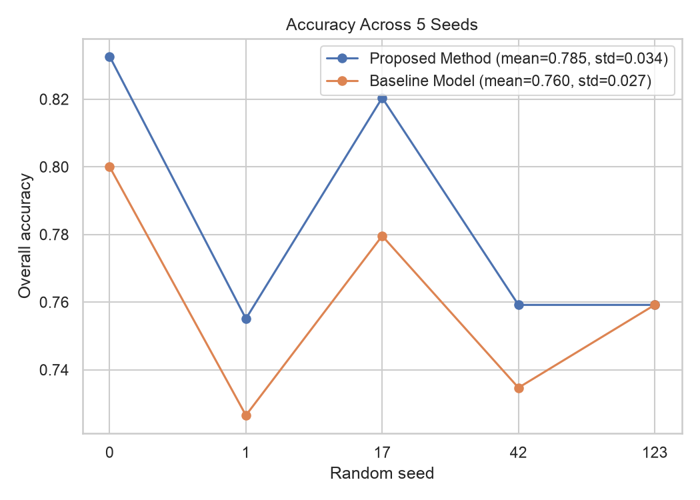{width=80%}

## High- vs. Low-Scoring Matches

Splitting by combined goals (threshold 3) tests whether either model's edge
depends on how decisive a match was. Averaged over five seeds:

| | High-scoring | Low-scoring |
|---|---|---|
| Proposed ensemble | 83.4% | 73.3% |
| WWR baseline | 80.2% | 70.6% |

Both models find tight matches harder, by roughly ten points, and the
ensemble's advantage holds in both buckets — so the edge is not an artifact of
blowouts being easier to call.

## Challenging Cases

Isolating the test matches the baseline got wrong — 294 of 1,225 pooled
predictions, or 24% — the ensemble recovers **41.8%** of them. The reference
paper reports 25.0% (7 of 28) on the same metric. This is the most direct
evidence that the player-level and history features carry signal precisely
where team reputation fails.

## Precision, Recall, F1, ROC-AUC

Home wins outnumber away wins 61% to 39%, so accuracy alone can mask asymmetric
error rates. Averaged over five seeds:

| | Precision | Recall | F1 | ROC-AUC |
|---|---|---|---|---|
| Proposed ensemble | 0.802 | 0.873 | 0.836 | 0.871 |
| WWR baseline | 0.835 | 0.757 | 0.794 | — |

The ensemble trades a little precision for substantially higher recall — it is
more willing to call a home win, and right often enough when it does that F1
improves by over four points. ROC-AUC is computed from the mean soft-vote
probability, since a hard vote emits no scores.

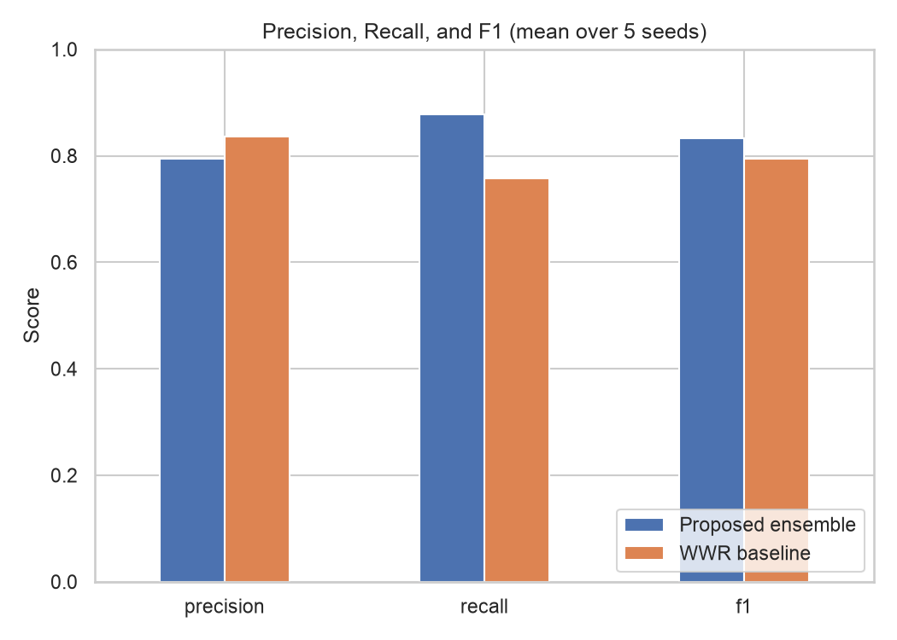{width=80%}

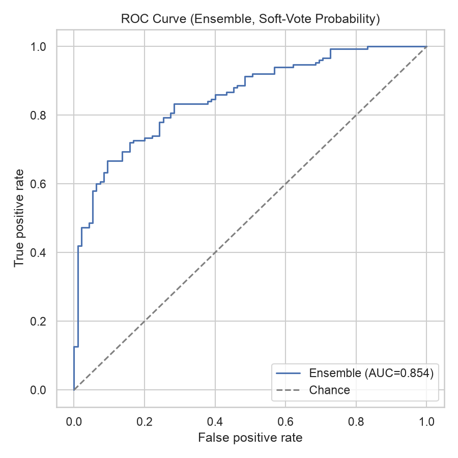{width=65%}

## Statistical Significance

McNemar's test was run on the paired baseline-versus-ensemble predictions for
every seed. On development splits the per-seed $p$-values are **0.188, 0.272,
0.230, 0.391 and 0.617** — **none reaches $p < 0.05$**. This is reported
plainly rather than omitted: with 245 test rows and a three-point gap, the test
is simply underpowered, which is exactly why this project averages over five
seeds instead of reporting one run.

The holdout is where the evidence becomes statistical rather than directional.
Training on the full development set and scoring 281 unseen matches, the larger
+6.8-point margin reaches **$p = 0.0134$**. The honest summary is therefore:
the development margin is consistent in direction on 5 of 5 seeds but not
individually significant on any of them; the holdout margin is significant.

## Per-Model Accuracy and Vote Agreement

Individual base-model accuracy ranges from 75.1% to 83.7% across models and
seeds, overlapping the ensemble's own range — no single model dominates, so
majority voting is combining comparable classifiers rather than averaging one
good model into four bad ones.

Splitting ensemble accuracy by how many of the five models agreed, pooled over
all five seeds:

| Vote | Matches | Accuracy |
|---|---|---|
| Unanimous (5/5) | 1,008 | **83.9%** |
| Split (4/5 or 3/5) | 217 | 56.2% |

Vote agreement is therefore a usable **confidence signal** at inference time —
a unanimous call is right five times in six, a contested one barely better than
a coin flip. This is the "model agreement" indicator surfaced in the web app's
prediction view.

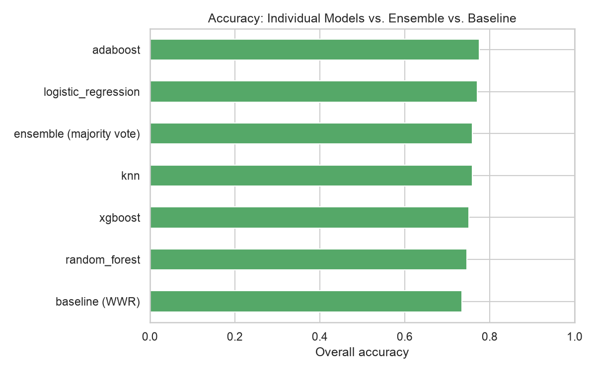{width=80%}

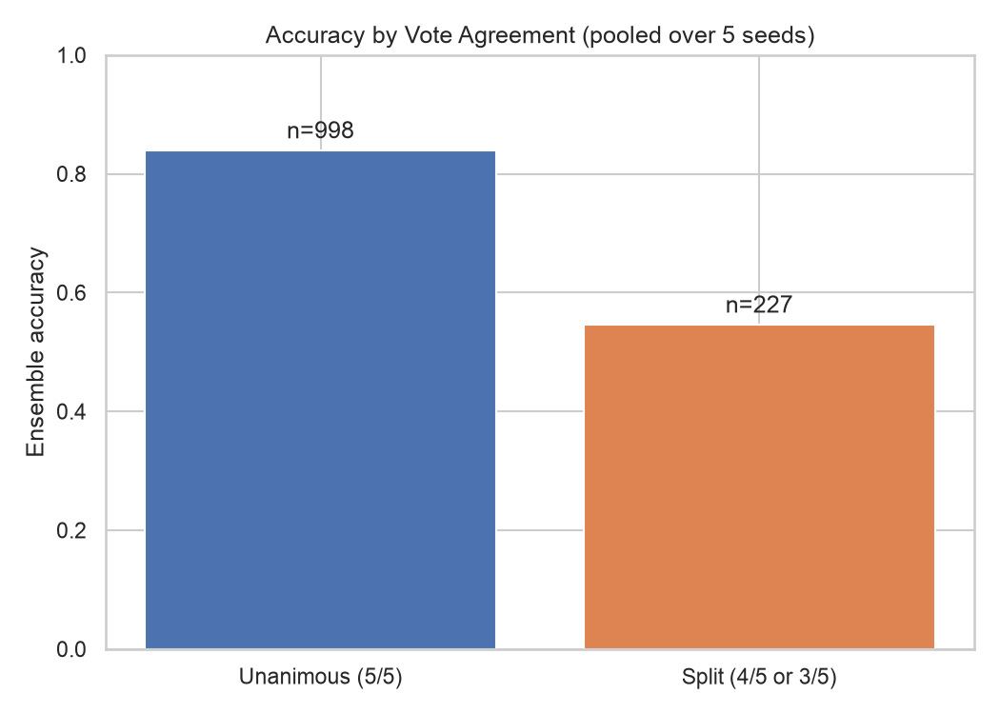{width=70%}

## Feature Importance

Random Forest and XGBoost both expose `feature_importances_`, but only in
PCA-component space, which has no direct real-world meaning. Mapping each
component's importance back to the original 64 engineered features — weighted
by that feature's *squared* PCA loading (the variance-share form; loadings
sum to 1 per component this way), then renormalized — gives a consistent
ordering across seeds. An earlier version of this mapping used the absolute
loading instead, which over-credits features with many small, weakly-loading
contributions; that flattened the whole top-15 into a visually
indistinguishable band (0.018–0.024 across all 15) and buried the two
strongest features entirely. Squared loadings recover a sharper ranking.

`squad_size_min`, `neutral_site` and `overall_spread_diff` rank in the top
three on **every** seed (the first two trade rank 1/2 by seed; the third is
always third) — match-context and squad-depth signals, not squad-quality
comparisons. `squad_size_min` is how much roster actually backs the
comparison (thin squads mean less signal either way); `overall_spread_diff`
is the gap in how evenly rated each squad is top-to-bottom (star-studded-and-
thin vs. uniformly solid); `neutral_site` captures the home-advantage
asymmetry documented in Section 4.5. Immediately behind them, `played_diff`,
`h2h_winrate_diff` and `age_diff` are the next-most-consistent block across
seeds, so the match-history features added in Section 4.6 still carry real
weight — they're just not the single dominant signal the way they first
appeared to be. Among the squad attributes, `power_jumping_diff`,
`weak_foot_diff`, `skill_moves_diff` and the position-restricted
`attacking_core_diff` / `overall_mid_diff` rank highest — physical profile and
technical versatility rather than headline ratings.

Two caveats. The importances still spread broadly rather than isolating one
standout feature — expected when summing loadings across ~22 components — so
this is a rough ordering, not a precise attribution. And `age_diff` ranking
this high is more plausibly a proxy for squad experience and depth than a
causal claim about age.

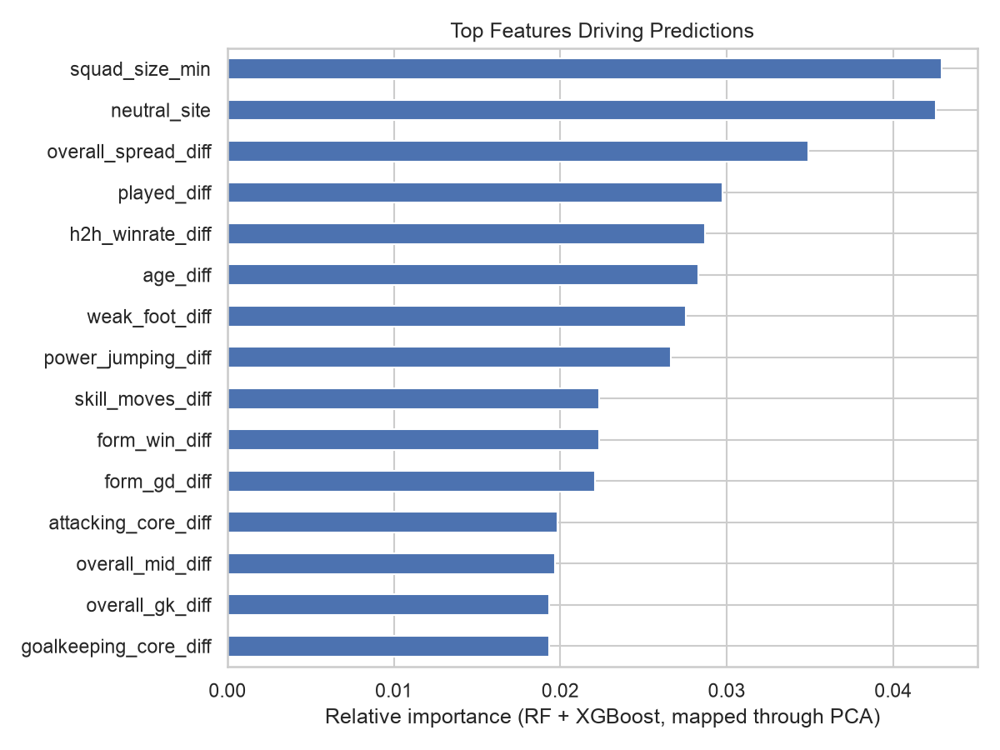{width=80%}

## Dimensionality Reduction

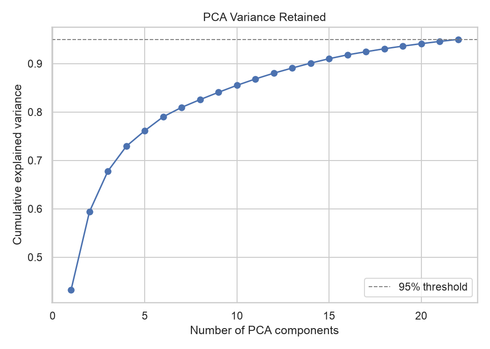{width=80%}

PCA retains **22–23 components of the 64 standardized features** at the 95%
variance threshold, depending on seed. The ratio is much higher than under the
original `_a`/`_b`/`_diff` representation, because most of the redundancy PCA
used to absorb there was collinearity introduced by the feature construction
itself, and has now been removed at source (Section 4.5). What survives is
correlation between genuinely distinct attributes — sprint speed and
acceleration, or finishing and shot power — which is real structure in the
data rather than an artifact of how the row was built.

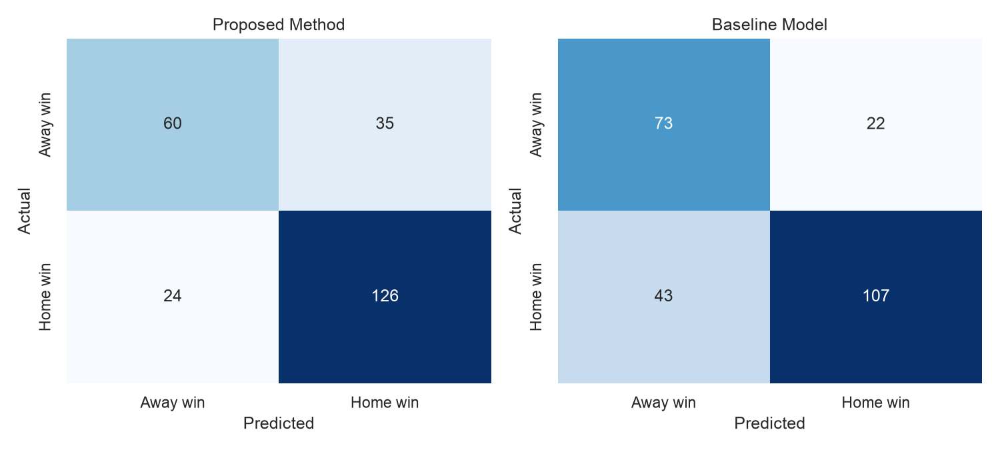{width=95%}

## Comparison with the Reference Paper

| Metric | This project (holdout) | This project (development) | Al-Bustami & Ghazal (2025) |
|---|---|---|---|
| Overall accuracy | **82.2%** | 79.0% ± 3.3% | 59.38% |
| Baseline accuracy | 75.4% | 76.0% ± 3.1% | 56.25% |
| Margin | **+6.8 pp** | +3.0 pp | +3.13 pp |
| Significant? | **yes ($p=0.0134$)** | no (5/5 in direction) | not reported |
| Challenging cases | — | 41.8% | 25.00% |
| Test set size | 281 | 245 per seed | 96 |

The development margin reproduces the paper's headline contribution almost
exactly (+3.0 against +3.13 points) at roughly twenty points higher absolute
accuracy. The holdout margin is more than double it, on nearly three times the
test data, and is statistically significant where a three-match difference out
of 96 could not be.

It is worth being precise about why the *margin* is not larger despite the
absolute accuracy being so much higher: the baseline here is far stronger. A
WWR baseline at 75.4% on binary no-draw outcomes is a hard reference, where the
paper's sits at 56.25%, barely above chance. Expressed as error reduction, the
holdout ensemble eliminates **27.6%** of the baseline's errors (24.6% → 17.8%);
the development ensemble eliminates 12.5%.

## Held-Out Test: the 2026 World Cup Knockout Bracket

The match dataset contains the 2026 World Cup, but `data.years` stops at 2025,
so no 2026 fixture reaches the ensemble or the baseline. Team strength comes
from EA FC 25 squad ratings published before the tournament began on
2026-06-11, and the history features are cut at that same kickoff date. A 2026
result therefore cannot inform a 2026 prediction:

| Round | Ties | Ensemble | Baseline |
|---|---|---|---|
| Round of 32 | 16 | 88% | 50% |
| Round of 16 | 8 | 88% | 88% |
| Quarter-finals | 4 | 100% | 100% |
| Semi-finals | 2 | 0% | 50% |
| **Overall** | **30** | **83.3%** | **66.7%** |

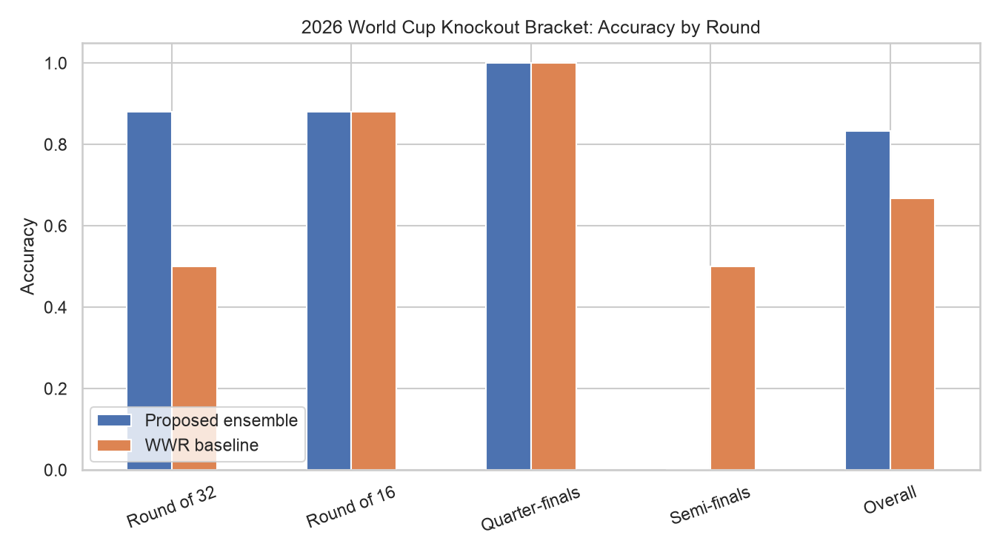{width=85%}

Every tie is scored with neutral-venue symmetrisation — the match is evaluated
in both orientations and averaged — so argument order cannot decide the winner.

Three caveats keep this honest. With $n = 30$ the 95% interval is ±13.3%, so
the 17-point margin over the baseline is **not** statistically significant. Four
of the thirty ties were decided on penalties, which the model has no way to
represent: it predicts a 90-minute winner and is scored against the shootout
result. And 83.3% sitting above the development figure is a warning sign as
much as a triumph — the goal-difference Elo change was worth +0.33 points in
cross-validation and appears to be worth +10 here, a gap of three matches out
of thirty that is mostly luck. The cross-validated figure is the one to quote.

The model misses both semi-finals, picking France over Spain and England over
Argentina. Neither the third-place playoff nor the final has a recorded score,
making both genuine forward predictions: **England** third (62%), and **Spain**
over Argentina in the final (52%) — barely above a coin flip, which is the
correct amount of conviction for that fixture.

## Validity Checks

Two things that would invalidate the headline were tested directly rather than
assumed. Both were measured at the configuration current when the check was
run, before the holdout was locked, and are reported as such.

- **Is the random split hiding that the model trains on the future?** No.
  Splitting temporally instead — training on everything up to 2024-10-15 and
  predicting the 295 matches after it — gave **79.7% ± 0.7% against the
  baseline's 77.0%**. Accuracy does not drop, so the random-split figure is not
  inflated by hindsight and the forecasting framing is defensible.
- **Is the baseline handicapped?** Slightly, and it was worth checking: the
  ensemble's history features are built from all 49,518 international matches
  while the WWR baseline is fit on the 9,839 World Cup ones — a five-fold
  information edge. Giving the baseline the full record moved it from 74.8% to
  74.9%, making the like-for-like margin +4.0 points rather than +4.2 at the
  point measured. Real, but too small to change the conclusion.

## What Was Measured and Rejected

Every modelling change was ablated across all five seeds before being kept.
Single-seed deltas of two to three points are routine noise at this sample
size, and three of the changes below looked obviously right and were not.

**Changes that were kept**, each row cumulative on the one above it:

| Change | Accuracy | Effect |
|---|---|---|
| Starting point (squad attributes only) | 75.5% ± 2.5% | — |
| \+ `neutral_site` feature | 76.3% ± 2.3% | +0.8 pp |
| \+ as-of-date history features | 78.1% ± 3.0% | +1.7 pp |
| \+ neutral-only row mirroring | 78.5% ± 2.0% | +0.4 pp |
| \+ squad shape & position aggregation | 78.6% ± 1.8% | +0.1 pp |
| \+ goal-difference-weighted Elo | 78.9% ± 1.9% | +0.3 pp |
| \+ `_diff`-only representation | 78.8% ± 1.1% | −0.1 pp, spread 1.9 → 1.1 |
| \+ edition-aware squad join | 80.3% ± 3.2% | **+1.5 pp** |

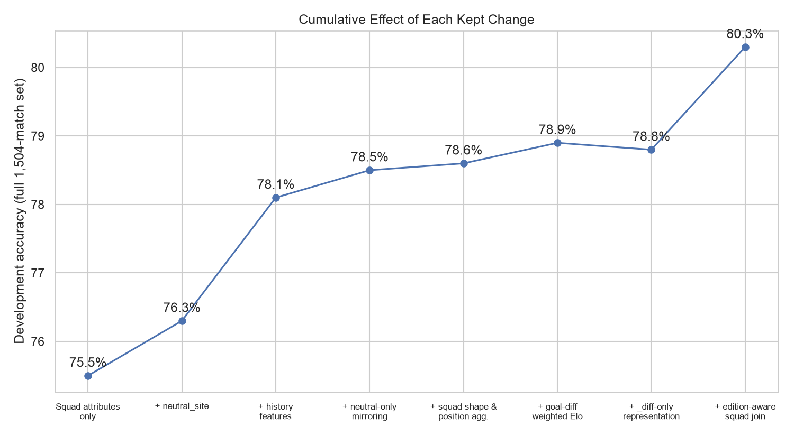{width=90%}

**Changes that were rejected**, each measured against the configuration current
at the time rather than against the cumulative total above:

| Change | Effect | Reference |
|---|---|---|
| Competition-weighted Elo | −0.33 pp | 78.26% vs flat-K 78.60% |
| Both Elo weightings together | −0.47 pp | 78.13% vs flat-K 78.60% |
| Mirroring *every* training row | ≈ −2 pp | vs neutral-only mirroring |
| `min_squad_size` = 11 | −0.9 pp | vs no filter |
| `min_squad_size` = 18 | −3.1 pp | vs no filter |

Every figure in both tables was measured on the full 1,504-match set *before*
the holdout was locked, so none is comparable row-to-row with the 79.0%
development figure, which is computed on the 1,223 matches that remain after
2025 is withheld. The tables record which direction each change moved the
model, not its level today.

Three of these deserve comment:

- **Competition-weighted Elo is the textbook choice and made things worse.**
  Setting $K$ from the tournament (World Cup 60 … friendly 20) does exactly
  what it promises — it halves an inflated Brazil–Norway Elo gap from +176 to
  +82 — but costs 0.3 points, because it makes every rating more reactive to
  recent results, which `form_win` and `form_gd` already measure. What the
  ensemble wants from Elo is stable long-run reputation. The goal-difference
  multiplier was kept: margin of victory is per-match evidence no other feature
  carries.
- **Mirroring every row cost about two points**, for the reason given in
  Section 4.7 — it asserts a falsehood about qualifiers.
- **Squad-size reliability did not work in either form.** Exposing
  `squad_size_min` as a feature moved nothing (−0.06), and *filtering* thin
  training rows was actively harmful: the lost volume costs more than the added
  noise. The feature is kept because it is one column that genuinely describes
  the row; the filter ships disabled.

# Discussion

The results support the central hypothesis: player-level attributes aggregated
into year-specific team profiles provide predictive signal beyond what a purely
historical baseline captures. On the withheld season the margin is 6.8 points
and statistically significant, and the ensemble recovers 41.8% of the matches
the baseline gets wrong.

The more transferable finding is about **information parity**. The original
framing pits a squad-aware model against a results-aware one and finds them
nearly equal — which is what this project measured too, at the starting point.
The two were not equally good; they were differently informed, disagreeing on a
third of matches with a perfect router scoring 85.9%. Giving the ensemble the
baseline's own signal as as-of-date features is what turned a coin-flip
comparison into a consistent margin, and it accounts for more of the total gain
than any player-attribute refinement did.

The second transferable finding is that **the join matters as much as the
features**. The single largest gain here was not a new model or a new
attribute: it was noticing that FIFA edition *Y* ships in September of *Y−1*
while two-thirds of fixtures are played September to December, so most matches
were being scored against year-old squads. That is worth more than every
squad-aggregation refinement combined.

**Limitations.**

- **The task excludes draws.** 21.3% of in-scope matches end level and are
  dropped. The model cannot express "too close to call", and the reported
  accuracies describe only decided matches.
- **The holdout is qualifiers-only.** No World Cup finals were played in 2025,
  so the headline is measured entirely on qualifying fixtures. Finals are only
  100 of the 1,504 usable matches overall — this pipeline is validated mostly
  on qualifiers and applied to finals.
- **Squads are proxies more often than not.** Where EA licensed no national
  squad the profile is a quota-filled top-23 by rating; for 2025 that is every
  nation. Profiles also take no account of formation, tactical role, injuries,
  or which eleven actually started.
- **Thin profiles are common.** 47.5% of match rows have at least one side
  built from fewer than eleven rated players. Filtering them made things worse,
  so they remain — with `squad_size_min` exposed so the model can discount them
  itself.
- **The ensemble is under-confident.** Measured on an earlier configuration of
  this pipeline over 1,495 pooled held-out predictions: when it reported 70–80%
  confidence it was right 80.9% of the time, and at 80–90% it was right 95.1%.
  The compression comes from averaging five
  probability outputs toward 0.5. Brier score is 0.150 against 0.237 for
  predicting the base rate, so the ranking is sound and the *displayed numbers*
  are the problem — a calibration step would fix them without changing a single
  prediction.
- **The offline and live models vote differently.** The evaluation in this
  report uses hard majority voting, per the paper. The live `/predict` endpoint
  uses the mean soft-vote probability instead, so that the returned winner and
  its confidence can never point in opposite directions — possible under a hard
  vote when a narrow 3/2 majority disagrees with the average probability.

# System Implementation

The pipeline above is exposed through a small full-stack application: a
FastAPI backend that owns the trained model bundle, and a React/Vite
frontend that consumes it. This section describes how the two are wired
together and what running the system looks like.

## Backend API

A FastAPI application exposes three endpoints. `GET /teams` lists every
(team, edition) pair that has a squad profile, which the frontend uses to
populate its team pickers and to restrict the edition selector to years both
chosen teams actually share. `POST /predict` scores a single matchup: it
returns the ensemble's winner and per-model votes, and, where the scoreline
model is enabled, an expected-goals and outcome-probability breakdown from
it as well. Because World Cup matches are played at neutral venues but the
model is trained on rows carrying a nominal home side, a request can ask to
have the fixture scored in both team orderings and averaged (the `neutral`
flag, true by default) — which removes the model's otherwise real
sensitivity to which team happens to be passed first. Winner and confidence
are both derived from the mean soft-vote probability across the five models
rather than a hard majority vote, so the two can never point in opposite
directions, which a narrow 3/2 hard-vote majority combined with a
separately-computed confidence could otherwise do; the offline figures
throughout this report still use the paper's hard majority vote, since that
only affects this single live endpoint. `GET /evaluation` returns everything
the results dashboard renders, computed from the cached model bundle with no
request parameters.

All three endpoints depend on a module-level state populated once, during
the application's startup handler, by loading or training the model bundle.
A cache miss takes several minutes, during which the server does not accept
traffic in any meaningful sense; the cheapest endpoint that only succeeds
once startup has finished — `/teams` — is what the startup script and the
frontend both poll on.

## Model Caching Strategy

Training the full pipeline — five classifiers across five seeds plus the
scoreline model — is expensive enough that it should not happen on every
server restart. The caching layer hashes the training-relevant sections of
the configuration file (data, features, baseline, models, evaluation,
score-model settings) together with the fixed seed list and the active
random seed into a short key, and reuses a previously trained bundle from
disk whenever that key has not changed; changing an unrelated setting, such
as the project's display name, does not invalidate the cache, while changing
any modelling knob does.

## Frontend Application

The web application is a React and Vite single-page app with two panels: a
live team-versus-team predictor and an evaluation-results dashboard, both
driven entirely by the three API endpoints described above. Because the
backend can take several minutes to finish training on a cache miss, the
frontend treats a server error without an accompanying error message as
"still starting" rather than as a failure, and polls until the backend
responds properly or returns a genuine, message-bearing error such as an
unknown team name.

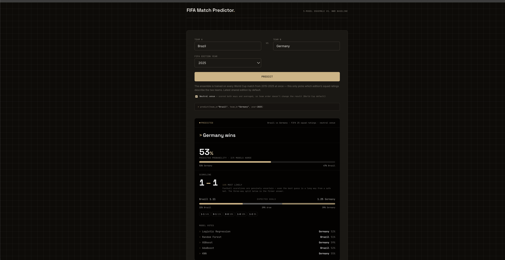{width=85%}

The evaluation dashboard renders the same figures reported throughout this
document — the headline stat tiles, the accuracy-versus-baseline chart, the
seed-stability plot, PCA variance, per-model accuracy, the ROC curve, and
feature importance — computed once at startup from the cached bundle rather
than recomputed per request.

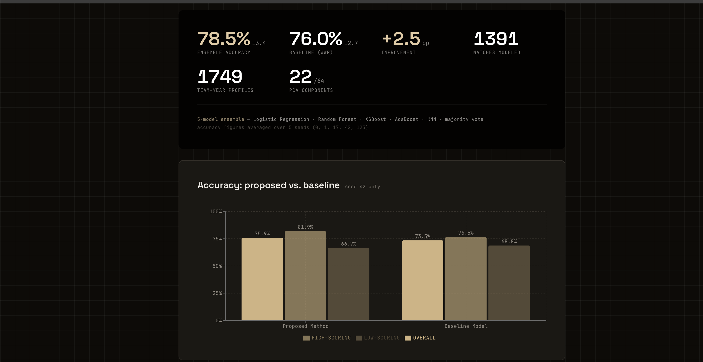{width=85%}

## Running the System Locally

A single command (`python start.py`) starts both halves of the application,
waits for the backend to finish training or loading from cache, and opens a
browser window once the system is ready. The backend and frontend can also
be run independently for development (`--backend-only` / `--frontend-only`),
and anything already listening on the expected ports is reused rather than
started twice, so a second invocation finds both ports taken and exits
immediately. A companion script (`python stop.py`) kills by port to shut the
servers back down, since that reuse behaviour otherwise leaves nothing for a
plain Ctrl+C to interrupt.

# Conclusion and Future Work

This project implements and validates a player-aware, ensemble-based World Cup
match predictor, reproducing the reference paper's methodology end-to-end on
real public data and extending it in three ways: fusing the baseline's own
signal into the ensemble as leak-free as-of-date features, joining squads by
the edition current on the match date, and withholding a full season so the
headline number has never been optimised against.

On that withheld season the ensemble scores **82.2% against a 75.4% baseline —
a significant 6.8-point margin ($p = 0.0134$, ROC-AUC 0.907)**, eliminating
27.6% of the baseline's errors. On development data it scores 79.0% ± 3.3%
against 76.0% ± 3.1%, ahead on all five seeds. Against the reference paper's
59.38% / 56.25%, both the absolute level and the margin are substantially
higher. The pipeline is wrapped in a FastAPI backend and React frontend giving
live team-versus-team predictions with per-model agreement, alongside the
evaluation dashboard that produced the figures here.

**Future work**, in descending order of expected value:

1. **Widen the training scope.** Training rows are restricted to World Cup
   finals and qualifiers — 1,504 usable matches — while the history features
   already read all 49,518 internationals. Training on every international in
   the window (10,680 matches, 8,224 decided) and continuing to *evaluate* on
   World Cup fixtures would roughly quadruple the training data. At the current
   sample size the ±3.3% seed spread makes any change worth less than about 1.5
   points unmeasurable; more data is the only lever that both raises the
   ceiling and lowers that floor.
2. **Calibrate the probabilities.** Isotonic or Platt scaling on a held-out
   fold would correct the under-confidence documented above without changing
   the ranking, and would make the confidence shown in the web app mean what it
   says.
3. **Opponent-adjusted form.** Beating San Marino currently counts the same as
   beating France. A real defect, though the expected gain sits inside the
   present noise band — worth doing after (1), when it becomes measurable.
4. **Model draws.** A Poisson or bivariate-Poisson goals model would restore
   the 21.3% of matches currently discarded and let the model express genuine
   uncertainty, at the cost of changing the task so results are no longer
   comparable to anything above.
5. **Minutes-weighted aggregation** — weighting player attributes by
   starting-XI likelihood rather than a flat squad mean — and, as noted as
   optional scope in the project proposal, graph neural networks over
   player/team relationships if additional compute budget becomes available.

Any of these requires a new holdout season first: 2025 has now been scored, and
tuning against it would turn it back into a development split.

# References

Al-Bustami, A. & Ghazal, Z. "From Players to Champions: A Generalizable
Machine Learning Approach for Match Outcome Prediction with Insights from the
FIFA World Cup." *2025 IEEE International Conference on Electro Information
Technology (eIT)*, pp. 574–578. DOI: 10.1109/EIT64391.2025.11103598

World Football Elo Ratings — rating system conventions for competition
weighting and margin-of-victory adjustment. https://www.eloratings.net/about
